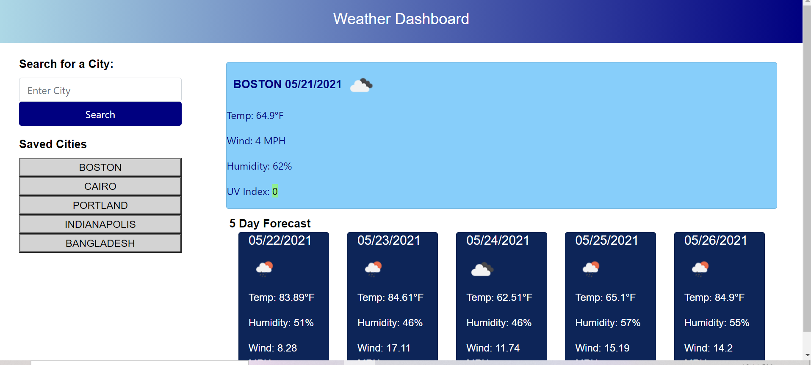

# get-me-weather

## Description
- When a user submits a city it will return the current weather and a five day forecast.  If the user enters an invalid city or the api is not working an alert will pop up asking the user to reenter a valid city.
- When the user submits a city it will be saved and can then be clicked upon in the future to present weather info.

## Deployed Page Link
- https://j2021t.github.io/get-me-weather/

## Deployed Page Screenshot
